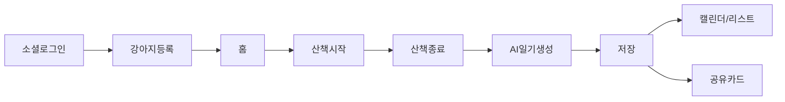
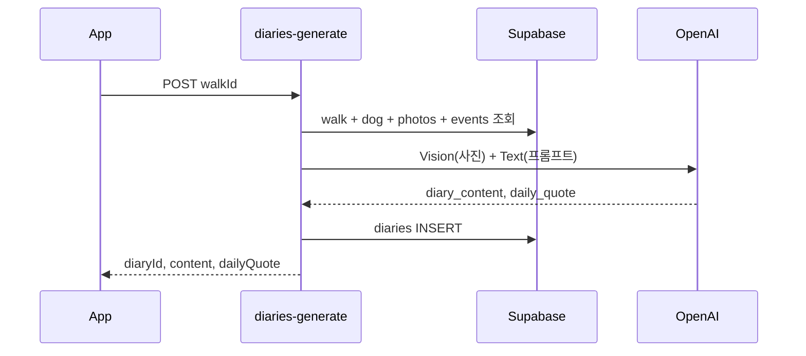

# 멍멍로그 MVP 앱 개발 계획

## 현재 상태

- **앱**: [package.json](package.json) — Expo 56 + Expo Router, 기본 스타터 템플릿만 존재 ([src/app/index.tsx](src/app/index.tsx) 플레이스홀더)
- **백엔드**: 없음 — Supabase 프로젝트·스키마·Edge Functions 전부 신규 구축
- **기술 스택 (PRD 확정)**: React Native (Expo) / Supabase / OpenAI API

## MVP 핵심 루프



---

## Phase 0-0. Cursor Rules & 코딩 컨벤션 (착수 전 필수)

개발 시작 전 `.cursor/rules/`에 5개 규칙 파일을 작성합니다. 기존 스타터 템플릿의 kebab-case 파일(`themed-text.tsx` 등)은 점진적으로 신규 컨벤션으로 교체합니다.

### 규칙 파일 목록

| 파일                      | 적용 범위                                   | 역할                                |
| ------------------------- | ------------------------------------------- | ----------------------------------- |
| `projectOverview.mdc`     | alwaysApply                                 | 기술 스택, Expo v56 문서, 폴더 구조 |
| `namingConventions.mdc`   | alwaysApply                                 | 파일/함수/변수/타입 네이밍          |
| `reactNativePatterns.mdc` | `src/**/*.tsx`                              | 컴포넌트·화면·스타일 패턴           |
| `supabasePatterns.mdc`    | `supabase/**`, `src/lib/**`, `src/hooks/**` | DB/API/Edge Function                |
| `stateManagement.mdc`     | `src/hooks/**`, `src/stores/**`             | Zustand + React Query               |

### 프로젝트 구조 (확정 — Expo 기본 템플릿)

[Expo Start developing — File structure](https://docs.expo.dev/get-started/start-developing/) 기준. 현재 레포 구조를 유지·확장합니다. **`features/` 레이어는 사용하지 않습니다.**

```
src/
  app/                         # Expo Router — 파일 구조 = 네비게이션 (Expo 기본)
    _layout.tsx                # 루트 레이아웃
    (auth)/login.tsx           # SC-01
    (onboarding)/              # SC-02~04
      dogBasic.tsx
      dogPersonality.tsx
      welcome.tsx
    (tabs)/                    # SC-05, 09, 10, 설정
      _layout.tsx
      index.tsx                # 홈
      calendar.tsx
      list.tsx
      settings.tsx
    walk/                      # SC-06, 07
      active.tsx
      finish.tsx
    diary/                     # SC-08, 11
      generate.tsx
      [id].tsx
    share/                     # SC-12
      [diaryId].tsx
  components/                  # 재사용 UI (Expo 기본)
    ui/                        # Button, Chip, Card, PawProgress ...
    auth/                      # LoginForm 등
    walk/                      # WalkMap, WalkStats ...
    diary/                     # DiaryCard, QuoteCard ...
  hooks/                       # 커스텀 훅 + React Query (Expo 기본)
    useAuthSession.ts
    useDiaries.ts
    useWalkTracker.ts
  constants/                   # 상수·옵션 (Expo 기본)
    theme.ts
    personalityOptions.ts
  lib/                         # Supabase/API 연동 (백엔드용 최소 추가)
    supabase.ts
    queryClient.ts
    api/                       # dogApi, walkApi, diaryApi ...
    mappers/                   # DB snake_case → camelCase
    utils/                     # formatDistance 등
  types/                       # 공유 TypeScript 타입
    database.ts
  stores/                      # Zustand (산책 세션 등 클라이언트 상태)
    walkStore.ts
  global.css
supabase/                      # 백엔드 (프로젝트 루트)
  migrations/
  functions/
```

**레이어 규칙 (Expo 기본 구조 내)**

| 폴더              | 역할                                                                                                                                 |
| ----------------- | ------------------------------------------------------------------------------------------------------------------------------------ |
| `src/app/`        | 화면·라우트. Expo Router [file-based routing](https://docs.expo.dev/get-started/start-developing/) — `_layout.tsx`로 네비게이션 구성 |
| `src/components/` | 화면에서 분리한 재사용 UI. 2곳 이상에서 쓰이면 추출                                                                                  |
| `src/hooks/`      | 데이터 fetching, mutation, 권한, 타이머 등 재사용 로직                                                                               |
| `src/constants/`  | 테마 토큰, 성격/말투 옵션 등                                                                                                         |
| `src/lib/`        | Supabase client, API 함수, mapper, 순수 유틸                                                                                         |
| `src/stores/`     | Zustand — 산책 진행 등 서버 외 세션 상태                                                                                             |
| `src/types/`      | DB/API 공유 타입                                                                                                                     |

- 화면 본문은 **`app/`에 두고**, 200줄 초과·재사용 UI는 `components/`로 분리
- Supabase/API 호출은 **`hooks/` 또는 `lib/api/`** 에만 — `app/`·`components/`에서 client 직접 import 금지

### 네이밍 컨벤션 (확정)

| 대상                       | 규칙                              | 예시                                                    |
| -------------------------- | --------------------------------- | ------------------------------------------------------- |
| 폴더                       | camelCase                         | `components/walk/`, `lib/api/`                          |
| 컴포넌트 파일              | PascalCase                        | `Button.tsx`, `WalkMap.tsx`                             |
| 훅 파일/함수               | camelCase, `use` 접두             | `useWalkTracker.ts`, `useDiaries()`                     |
| app 라우트 파일            | camelCase                         | `dogBasic.tsx`, `active.tsx` (Expo Router URL 세그먼트) |
| 유틸/API/상수              | camelCase                         | `formatDuration.ts`, `walkApi.ts`, `theme.ts`           |
| React 컴포넌트             | PascalCase                        | `WalkActiveScreen`, `PawProgress`                       |
| 함수/변수                  | camelCase                         | `startWalk()`, `walkId`, `isLoading`                    |
| TypeScript 타입/인터페이스 | PascalCase                        | `DogProfile`, `WalkSession`                             |
| enum                       | PascalCase 이름, UPPER_SNAKE 값   | `DogMeetingLevel.ONE_TO_TWO`                            |
| Zustand store              | `{domain}Store.ts`, `useXxxStore` | `walkStore.ts`, `useWalkStore`                          |
| React Query key            | `{domain}Keys` 객체               | `diaryKeys.list()`, `walkKeys.detail(id)`               |
| DB 테이블/컬럼             | snake_case (Supabase)             | `walk_locations`, `daily_quote`                         |
| Edge Function              | kebab-case 폴더                   | `diaries-generate/`, `auth-kakao/`                      |
| 환경 변수                  | UPPER_SNAKE                       | `EXPO_PUBLIC_SUPABASE_URL`                              |
| 라우트 app 파일            | camelCase (Expo Router)           | `dogBasic.tsx`, `active.tsx`                            |

**DB ↔ 앱 변환**: Supabase row(snake_case)는 `lib/mappers/` + `types/`에서 camelCase로 변환. 컴포넌트에서 snake_case 직접 사용 금지.

```typescript
// src/lib/mappers/walkMappers.ts
export function toWalkSession(row: WalkRow): WalkSession {
  return {
    walkId: row.id,
    startedAt: row.started_at,
    distanceMeter: row.distance_meter,
  };
}
```

### 함수 네이밍 패턴

| 종류          | 패턴                             | 예시                                            |
| ------------- | -------------------------------- | ----------------------------------------------- |
| API 호출      | `{verb}{Entity}`                 | `fetchDiaries`, `createDog`, `finishWalk`       |
| Mutation hook | `use{Verb}{Entity}`              | `useCreateDog`, `useGenerateDiary`              |
| Query hook    | `use{Entity}`, `use{Entity}List` | `useDiary(id)`, `useDiaryList`                  |
| 이벤트 핸들러 | `handle{Action}`                 | `handleWalkStart`, `handlePhotoPick`            |
| boolean       | `is/has/can/should` 접두         | `isWalkActive`, `hasPhotos`, `canGenerateDiary` |
| 변환/포맷     | `{verb}{Target}`                 | `formatDistance`, `parsePersonality`            |

### 상태 관리 규칙 (Zustand + React Query)

| 데이터             | 도구                         | 예시                       |
| ------------------ | ---------------------------- | -------------------------- |
| 서버 데이터 (CRUD) | React Query                  | 일기 목록, 강아지 프로필   |
| 진행 중 산책 세션  | Zustand                      | GPS 버퍼, 타이머, 일시정지 |
| 온보딩 폼 임시값   | Zustand 또는 react-hook-form | 강아지 등록 multi-step     |
| UI-only (모달, 탭) | 로컬 useState                | 캘린더 선택 날짜           |

- React Query hook: `src/hooks/useDiaries.ts`, `src/hooks/useCreateDog.ts`
- Zustand store: `src/stores/walkStore.ts` → `useWalkStore`
- 서버 데이터를 Zustand에 복제하지 않음 (캐시는 React Query가 담당)

### React Native / Expo 패턴

- 함수형 컴포넌트 + TypeScript strict
- 스타일: `StyleSheet.create` co-located (MVP). NativeWind 도입 시 별도 rule 추가
- 색상/간격: `constants/theme.ts` 토큰만 사용, 하드코딩 hex 금지
- `@/` path alias → `src/`
- Expo SDK 56 문서 기준 API 사용 ([AGENTS.md](AGENTS.md), [Start developing](https://docs.expo.dev/get-started/start-developing/))
- `app/` 화면: default export (Expo Router 요구). named export 컴포넌트는 `components/`에 배치
- Presentational 분리: 200줄 초과 시 `components/{domain}/`로 추출

### Supabase / API 패턴

- 클라이언트: `src/lib/supabase.ts` 단일 인스턴스
- 테이블 접근: `src/lib/api/{domain}Api.ts` — `dogApi.ts`, `walkApi.ts`, `diaryApi.ts`
- Edge Function 호출: `src/lib/api/edgeFunctions.ts`
- RLS 전제 — 클라이언트에서 service role key 사용 금지
- 에러: `{ domain }Api`에서 `AppError`로 wrap, UI는 toast/alert로 표시

### 금지 사항

- `features/` 도메인 레이어 신규 도입
- `app/`·`components/`에서 Supabase client 직접 import (`hooks/`·`lib/api/` 경유)
- snake_case 변수명을 TS/React 코드에 사용
- magic number/string — `constants/`로 추출

---

## Phase 0. 프로젝트 기반 (1주)

### 0-1. 의존성 및 프로젝트 구조

**추가 패키지 (Expo SDK 56 호환 확인 후 설치)**

| 영역        | 패키지                                   |
| ----------- | ---------------------------------------- |
| 백엔드      | `@supabase/supabase-js`                  |
| 상태/데이터 | `@tanstack/react-query`, `zustand`       |
| 폼          | `react-hook-form`, `zod`                 |
| 위치        | `expo-location`, `expo-task-manager`     |
| 사진        | `expo-image-picker`, `expo-image`        |
| 지도        | `react-native-maps` (또는 Expo Maps)     |
| 공유        | `expo-sharing`, `react-native-view-shot` |
| 폰트        | `expo-font` (Baloo 2, Pretendard)        |

**디렉터리 구조** — [Expo 기본 구조](https://docs.expo.dev/get-started/start-developing/) (`app/`, `components/`, `hooks/`, `constants/`) + Supabase 연동용 `lib/`, `types/`, `stores/` 최소 추가. Phase 0-0 참조.

### 0-2. 디자인 시스템

[멍멍로그\_화면디자인.html](/Users/blunex/Downloads/멍멍로그_화면디자인.html) 기준 토큰을 [src/constants/theme.ts](src/constants/theme.ts)에 정의:

- 배경 `#F3E8D5`, 잉크 `#2B2B3D`, 애프리콧 `#FF8A5B`, 모스 `#6B8F71`, 클레이 `#E8B4A0`
- 공통 컴포넌트: `Button`, `Chip`, `Card`, `PawProgress`, `TabBar`
- 발자국 모티프: 온보딩 스텝, 캘린더 도트, AI 로딩 애니메이션

### 0-3. 환경 변수

```
EXPO_PUBLIC_SUPABASE_URL
EXPO_PUBLIC_SUPABASE_ANON_KEY
EXPO_PUBLIC_KAKAO_APP_KEY
EXPO_PUBLIC_NAVER_CLIENT_ID
```

서버 전용(Supabase Edge Function secrets): `OPENAI_API_KEY`, Kakao/Naver client secret, 날씨 API key

---

## Phase 1. Supabase 백엔드 (1~1.5주)

PRD·DB 문서 기준 8개 테이블 + Storage + RLS를 먼저 구축합니다.

### 1-1. DB 스키마 (`supabase/migrations/001_initial.sql`)

| 테이블           | 핵심 필드                                                                                                   |
| ---------------- | ----------------------------------------------------------------------------------------------------------- |
| `users`          | id(uuid PK), provider, email, nickname, profile_image, created_at                                           |
| `dogs`           | user*id FK, name, breed, birth_date, gender, personality(jsonb), speech_style, custom*\*, profile_image_url |
| `walks`          | dog*id FK, started_at, ended_at, duration_sec, distance_meter, weather*\*                                   |
| `walk_locations` | walk_id FK, latitude, longitude, recorded_at                                                                |
| `walk_events`    | walk_id FK, pee_count, poop_count, dog_meeting_level, memo                                                  |
| `walk_photos`    | walk_id FK, image_url, sort_order                                                                           |
| `diaries`        | walk_id FK UNIQUE, dog_id FK, diary_content, daily_quote, ai_model, generated_at                            |
| `share_cards`    | diary_id FK, image_url                                                                                      |

**관계**: users 1:N dogs → walks → (locations, events, photos) → diaries 1:N share_cards

### 1-2. Row Level Security

- 모든 테이블: `auth.uid() = users.id` 경로로 본인 데이터만 CRUD
- `walk_locations`, `walk_events`, `walk_photos`: 상위 `walks` 소유자 기준 서브쿼리 정책
- Storage bucket `dog-profiles`, `walk-photos`, `share-cards`: 사용자별 폴더 `{userId}/...`

### 1-3. Storage 정책

- 강아지 프로필: `dog-profiles/{userId}/{dogId}.jpg`
- 산책 사진: `walk-photos/{userId}/{walkId}/{order}.jpg` (최대 5장, 용량 제한 예: 5MB)
- 공유 카드: `share-cards/{userId}/{diaryId}.png`

### 1-4. Edge Functions (REST API 래핑)

API 명세의 엔드포인트를 Edge Function으로 구현:

| Function                   | 역할                                                   |
| -------------------------- | ------------------------------------------------------ |
| `auth-kakao`, `auth-naver` | OAuth token 검증 → Supabase user upsert → JWT 반환     |
| `diaries-generate`         | walk 데이터 수집 → OpenAI Vision+Text → diaries INSERT |
| `share-card`               | 일기+사진 → 이미지 카드 렌더 → Storage 업로드          |
| `welcome-greeting`         | SC-04 온보딩 인사말 생성 (경량 OpenAI 호출)            |

**직접 Supabase Client로 처리할 API** (RLS 활용):

- `POST/GET/PUT /dogs` → `dogs` 테이블
- `POST /walks/start`, `/finish`, `/locations`, `/events`, `/photos` → 각 테이블
- `GET /diaries`, `/diaries/{id}`, `GET /calendar` → 조회 쿼리

---

## Phase 2. 인증 & 온보딩 (1주)

### 2-1. SC-01 로그인

- 카카오/네이버 SDK 연동 (`@react-native-kakao`, 네이버 로그인 또는 Web OAuth)
- Edge Function으로 accessToken 교환 → Supabase session 저장
- 세션 persist: `@supabase/supabase-js` + AsyncStorage
- **분기**: `GET /dogs` 결과 유무 → 신규: SC-02 / 기존: SC-05

### 2-2. SC-02~03 강아지 등록

- 3단계 발자국 프로그레스 (기본정보 → 성격·말투 → 완료)
- 성격: 다중 칩 (활발함/소심함/먹보/장난꾸러기/츤데레/애교쟁이/기타)
- 말투: 단일 칩 (기본/아기말투/반말/존댓말/기타), 선택사항
- `POST /dogs` + 프로필 사진 Storage 업로드

### 2-3. SC-04 등록완료 · AI 인사말

- `welcome-greeting` Edge Function 호출
- 발자국 로딩 → 말풍선 카드 표시
- CTA "산책하러 가볼까?" → 홈

---

## Phase 3. 홈 & 산책 (1.5~2주)

가장 기술 난이도가 높은 구간입니다.

### 3-1. SC-05 홈

- 강아지 프로필 요약, 오늘 산책 상태 카드
- 원형 "산책 시작" CTA
- 최근 일기 1~2건 미리보기
- 하단 탭: 홈 / 캘린더 / 리스트 / 설정

### 3-2. SC-06 산책 진행

**위치 수집**

- `expo-location` foreground + background task
- 10~30초 간격으로 `POST /walks/{walkId}/locations` 배치 전송
- 실패 시 로컬 큐 → 재시도 (AsyncStorage)

**실시간 UI**

- `react-native-maps`에 GPS 경로 polyline
- 경과 시간 타이머, 누적 거리 (Haversine 계산)
- 날씨: OpenWeatherMap 등 외부 API (위·경도 기준, Edge Function proxy 권장)
- 일시정지 / 길게 눌러 종료

**시작/종료 API**

- 시작: `POST /walks/start { dogId }` → walkId
- 종료: `POST /walks/{walkId}/finish { endedAt, distanceMeter, durationSec, weather }`

### 3-3. SC-07 산책 종료 입력

- 요약 바 (거리/시간/날씨)
- 사진 1~5장 (`expo-image-picker`, multipart upload)
- 배변(소변/대변 다중), 친구 만남(단일), 자유 메모
- `POST /walks/{walkId}/events` + photos
- "AI 일기 만들기" CTA (사진 1장 이상 시 활성)

**예외 처리 (PRD 비기능)**

- GPS 권한 거부 → 수동 거리/시간 입력 fallback UI
- 업로드 실패 → 재시도 + 부분 성공 허용

---

## Phase 4. AI 일기 생성 (1~1.5주)

### 4-1. SC-08 AI 일기 결과

**생성 흐름**



**OpenAI 프롬프트 입력**

- 강아지: name, breed, personality[], speech_style
- 산책: duration, distance, weather, events, memo
- 사진: Vision API로 상황 분석 (공원/친구/간식 등)

**출력**

- `diary_content`: 1인칭 감성 일기
- `daily_quote`: "🐾 오늘의 한마디 : ..."
- `ai_model`, `generated_at` DB 기록

**UI**

- 로딩: 발자국 애니메이션 + "OO가 일기를 쓰고 있어요"
- 결과: 사진 캐러셀, 본문 카드, 한마디 강조, 산책 칩
- "저장만 하기" / "저장하고 공유하기"

**품질/안정성**

- 생성 실패 → 재시도 버튼 + fallback 템플릿
- 산책 1건당 일기 1건 (walk_id UNIQUE)
- 목표: 10초 이내 (스트리밍 또는 로딩 UX로 체감 완화)

---

## Phase 5. 일기 보관 (0.5~1주)

### 5-1. SC-09 캘린더

- `GET /calendar?year=&month=` → 작성일 발자국 도트
- 날짜 탭 → 하단 시트 미리보기 → SC-11 상세

### 5-2. SC-10 리스트

- `GET /diaries` 최신순/날짜별 정렬
- 썸네일 + 날짜 + daily_quote 한 줄
- 무한 스크롤 (cursor pagination)

### 5-3. SC-11 일기 상세

- `GET /diaries/{diaryId}` + walk_photos
- 사진 캐러셀, 본문, 한마디, 산책 메타 칩
- 공유 아이콘 → SC-12

---

## Phase 6. 공유 카드 (0.5~1주)

### 6-1. SC-12 공유 이미지 카드

- `POST /diaries/{diaryId}/share-card` → Edge Function
  - 대표 사진 + 일기 요약 + 한마디 + 강아지 이름 + 날짜
  - 서버 렌더(HTML→PNG) 또는 앱 내 `react-native-view-shot` + Storage 업로드
- 프리뷰 카드
- 공유 채널: 카카오톡 / 인스타그램 / 이미지 저장 (`expo-sharing`)
- "완료" → 홈 복귀

---

## Phase 7. 설정 & 마무리 (0.5주)

- **설정 탭**: 내 정보, 강아지 프로필 수정 (`PUT /dogs/{dogId}`), 로그아웃
- **앱 권한**: 위치, 카메라/갤러리 사전 안내
- **스플래시/아이콘**: 브랜드 컬러(#FF8A5B) 반영 ([app.json](app.json) 수정)
- **analytics 이벤트** (PRD KPI): login_complete, dog_registered, walk_started, diary_generated, share_card_created

---

## 화면–라우트 매핑

| ID    | 화면            | 라우트                         |
| ----- | --------------- | ------------------------------ |
| SC-01 | 로그인          | `/(auth)/login`                |
| SC-02 | 강아지 기본정보 | `/(onboarding)/dogBasic`       |
| SC-03 | 성격·말투       | `/(onboarding)/dogPersonality` |
| SC-04 | AI 인사말       | `/(onboarding)/welcome`        |
| SC-05 | 홈              | `/(tabs)/`                     |
| SC-06 | 산책 진행       | `/walk/active`                 |
| SC-07 | 산책 종료       | `/walk/finish`                 |
| SC-08 | AI 결과         | `/diary/generate`              |
| SC-09 | 캘린더          | `/(tabs)/calendar`             |
| SC-10 | 리스트          | `/(tabs)/list`                 |
| SC-11 | 상세            | `/diary/[id]`                  |
| SC-12 | 공유            | `/share/[diaryId]`             |

---

## 개발 우선순위 & 일정 (약 7~9주, 1~2명 기준)

| 주차 | 산출물                                       |
| ---- | -------------------------------------------- |
| 1    | Phase 0 + Supabase 스키마/RLS/Storage        |
| 2    | Phase 1 Edge Functions + Phase 2 인증/온보딩 |
| 3~4  | Phase 3 산책 (GPS, 지도, 사진)               |
| 5    | Phase 4 AI 일기 생성                         |
| 6    | Phase 5 보관 (캘린더/리스트/상세)            |
| 7    | Phase 6 공유 카드 + Phase 7 QA               |

**P0 (필수)**: F-01~F-09, F-11 — PRD 기능 ID 기준  
**P1 (MVP 포함)**: F-06 이벤트, F-10 캘린더  
**P2 (이후)**: F-12 일기 수정, 다견 관리

---

## 주요 리스크 & 대응

| 리스크                                 | 대응                                                                |
| -------------------------------------- | ------------------------------------------------------------------- |
| 카카오/네이버 OAuth 네이티브 연동 복잡 | Expo dev client + 커스텀 스킴, 테스트용 이메일 로그인 임시 fallback |
| 백그라운드 GPS (iOS)                   | `UIBackgroundModes: location`, TaskManager, 권한 UX 명확화          |
| OpenAI 비용/속도                       | gpt-4o-mini 우선, 사진 1~2장만 Vision, 프롬프트 캐싱                |
| 공유 카드 렌더                         | MVP는 앱 내 ViewShot → 서버 렌더는 Phase 2                          |
| GPS 거리 오차                          | 최소 이동 거리 필터, 이상치 제거                                    |

---

## 1차 착수 시 권장 순서

0. **Cursor Rules 5종 작성** (`.cursor/rules/`) — 본 Phase 0-0 스펙 그대로
1. Supabase 프로젝트 생성 + 마이그레이션 적용
2. 디자인 토큰 + 공통 UI 컴포넌트
3. Supabase Auth + 카카오 로그인 (1개 provider 먼저)
4. 강아지 등록 플로우 (SC-02~04)
5. 산책 start/finish (GPS 없이 수동 테스트) → GPS 추가
6. AI 일기 generate Edge Function
7. 홈/캘린더/리스트/상세/공유 순으로 UI 연결

이 순서는 **백엔드-프론트 병렬 없이** End-to-End로 핵심 루프를 빠르게 검증할 수 있습니다.
